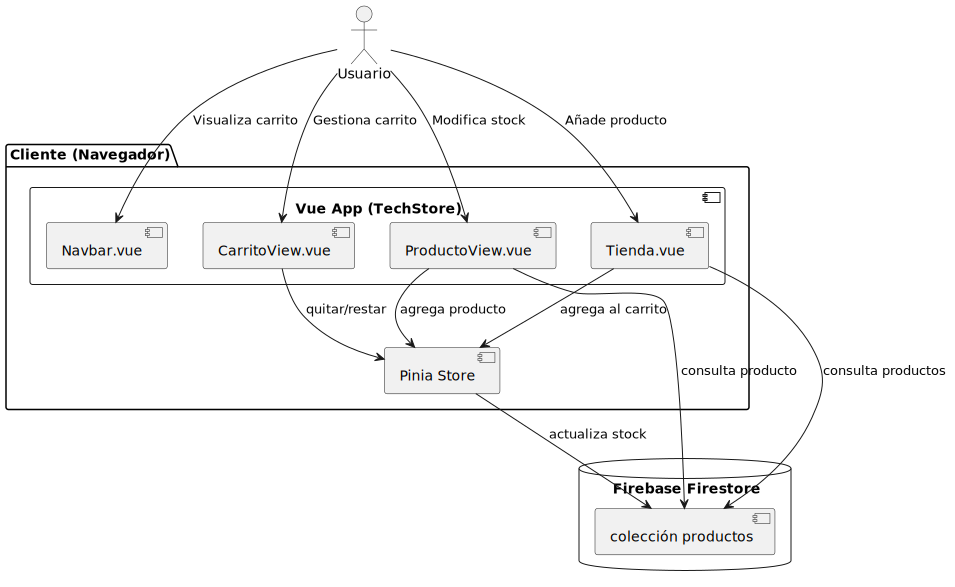
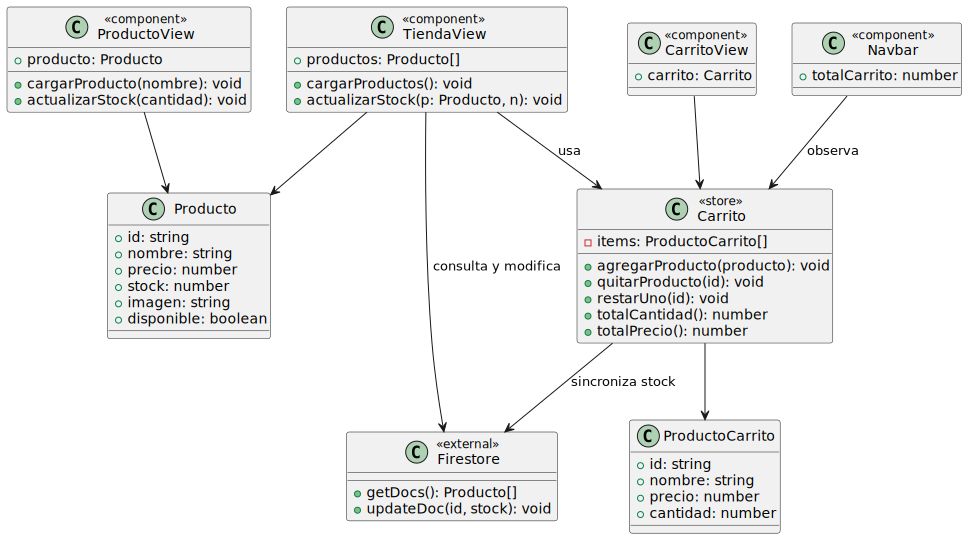

# 🛒 **Inventario Reactivo TechStore**

Proyecto web desarrollado en **Vue 3 + TypeScript + Firebase**, que permite gestionar el inventario de una tienda online de productos tecnológicos. El sistema reacciona a los cambios de stock y permite añadir productos a un carrito de compra simulado, **todo en tiempo real** gracias a la reactividad de Vue.

---

## 📖 Índice

1. [🚀 Características Principales](#🚀-características-principales)
2. [💻 Requisitos y Configuración](#💻-requisitos-y-configuración)
    - [⚙️ Ejecutar con Docker](#⚙️-ejecutar-con-docker)
    - [🧪 Ejecutar Manualmente](#🧪-ejecutar-manualmente-sin-docker)
3. [🛠️ Tecnologías y Arquitectura](#🛠️-tecnologías-y-arquitectura)
    - [📦 Diagrama de Arquitectura](#📦-diagrama-de-arquitectura)
    - [📐 Diagrama de Clases](#📐-diagrama-de-clases)
4. [📂 Estructura del Proyecto](#📂-estructura-del-proyecto)
5. [🛢️ Estructura de la Base de Datos](#🛢️-estructura-de-la-base-de-datos)
6. [📝 Contribución](#📝-contribución)
7. [🚀 Autor](#🚀-autor)
8. [📄 Preguntas de la Tarea](#📄-preguntas-de-la-tarea)

---

## 🚀 Características Principales

- ✅ Listado de productos tecnológicos.
- 🔁 Reactividad total al modificar el stock.
- 🟢 Color dinámico según disponibilidad.
- 🛒 Carrito con cantidad y suma total.
- 🔄 Actualización de stock en Firebase.
- 📦 Proyecto dockerizado listo para desplegar.

---

## 💻 Requisitos y Configuración

### Requisitos previos

- [Node.js](https://nodejs.org/) y `npm`
- [Docker](https://www.docker.com/)
- Una cuenta de Firebase con Firestore habilitado *(ya configurado en este proyecto)*

---

### ⚙️ Ejecutar con Docker

1. Clonar este repositorio:

    ```bash
    git clone https://github.com/tu-usuario/mi-tienda.git
    cd mi-tienda
    ```

2. Levantar el proyecto:

    ```bash
    docker-compose up --build
    ```

3. Accede a la aplicación en:

    ```plaintext
    http://localhost:3000
    ```

---

### 🧪 Ejecutar Manualmente (sin Docker)

1. Instalar dependencias:

    ```bash
    npm install
    ```

2. Ejecutar el servidor de desarrollo:

    ```bash
    npm run dev
    ```

3. La app se abrirá en [http://localhost:5173](http://localhost:5173) por defecto.

---

## 🛠️ Tecnologías y Arquitectura

- **Vue 3 + TypeScript**
- **Pinia** (gestión de estado)
- **Firebase Firestore** (base de datos en tiempo real)
- **Tailwind CSS**
- **Docker + Nginx** para despliegue

### 📦 Diagrama de Arquitectura



### 📐 Diagrama de Clases



---

## 📂 Estructura del Proyecto

```plaintext
mi-tienda/
├── public/
├── src/
│   ├── assets/
│   ├── components/
│   │   ├── Navbar.vue
│   │   ├── ProductoDetalle.vue
│   │   └── Tienda.vue
│   ├── firebase/
│   │   └── firebase.ts
│   ├── router/
│   │   └── index.ts
│   ├── stores/
│   │   └── useCarritoStore.ts
│   ├── views/
│   │   ├── CarritoView.vue
│   │   ├── ProductoView.vue
│   │   └── Home.vue
│   ├── App.vue
│   ├── main.ts
│   ├── style.css
│   └── vite-env.d.ts
├── Dockerfile
├── docker-compose.yml
├── README.md
└── package.json
```

---

## 🛢️ Estructura de la Base de Datos

🔥 **Colección: productos** (en Firestore)

| Campo   | Tipo   | Descripción                     |
|---------|--------|---------------------------------|
| `id`    | string | ID del documento (generado por Firestore) |
| `nombre`| string | Nombre del producto            |
| `precio`| number | Precio en dólares              |
| `stock` | number | Cantidad disponible            |
| `imagen`| string | URL de la imagen               |

---

## 📝 Contribución

Este proyecto ha sido desarrollado como parte de la asignatura **Programación Web II** en la Universidad Europea del Atlántico.  
¡Las sugerencias, mejoras y pull requests son bienvenidas!

---

## 🚀 Autor

**Juan José Cobo Cano**  
Estudiante de Ingeniería Informática

---

## 📄 Preguntas de la Tarea

Puedes consultar las respuestas a las preguntas de la tarea en el archivo [PreguntasTarea.md](PreguntasTarea.md).